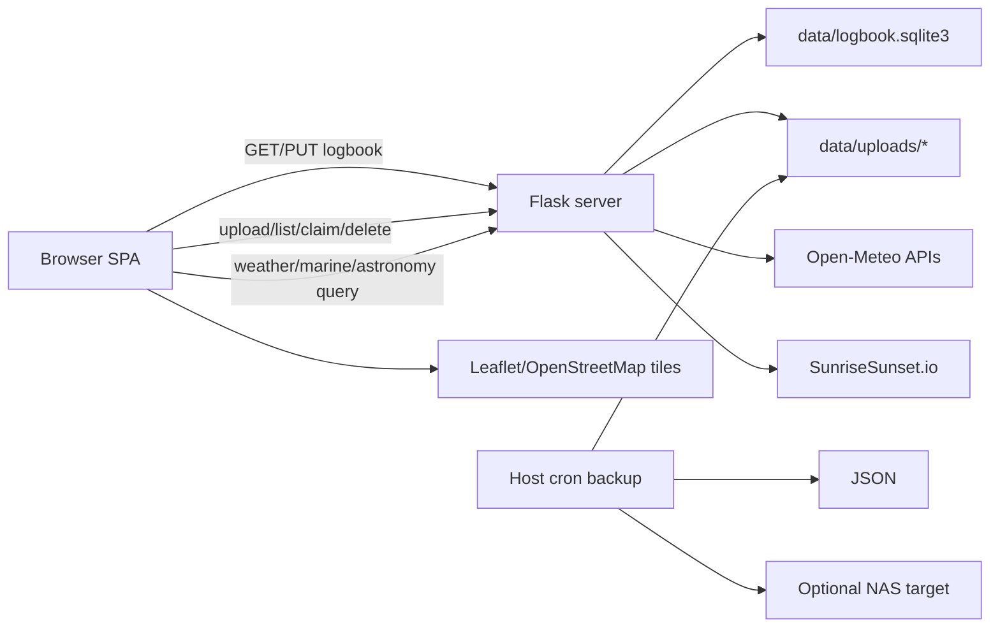

# Architecture

## System Context

Selfhostable Fishing Logbook is a small single-process web application for one trusted operator or household. Flask serves a plain-JavaScript single-page interface, proxies environmental APIs, and reads/writes a SQLite logbook. Uploaded media stays on the local filesystem.

## Runtime Components

### Frontend

`index.html` contains all six routed screens, dialogs, and row templates. Scripts are loaded as classic global scripts in dependency order; there are no modules, package manager, compilation, or bundling.

- `app-state.js`: defaults, shared state, DOM handles, normalization, units, load/save, media rendering.
- `app.js`: route/view switching and event delegation.
- `trip-editor.js`, `form-utils.js`, `trolling-spread.js`: trip lifecycle and method-specific fishing behavior.
- `locations.js`, `location-weather.js`: mapped locations and environmental enrichment.
- `photos.js`, `gallery.js`: metadata extraction, upload assignment, gallery, cleanup.
- `gear.js`: lure, flasher, rod, reel, combo, and line-history workflows.
- `dashboard.js`, `stats.js`, `maps-summary.js`: lists, analytics, maps, summary reports, spread, timeline.
- `settings.js`, `data-transfer.js`: preferences and import/export.

Shared mutable globals couple these files. HTML IDs/classes are effectively internal APIs.

### Backend

`server.py` creates the Flask app and owns HTTP routing. Helpers are separated by concern:

- `logbook_store.py`: whole-document normalization, validation, and SQLite I/O.
- `media_service.py`: upload paths, metadata sidecars, preview generation, references, gallery, orphans.
- `weather_service.py`: allowlisted external proxies and an unexposed bulk-enrichment implementation.
- `backend_config.py`: paths, defaults, units, media categories, external URLs, allowlists.

The Flask development server runs threaded. There is no application-level lock around the read-modify-write JSON workflow.

### Persistence

The application stores its logbook in `data/logbook.sqlite3`. Top-level collections such as `lures`, `locations`, and `trips` are individual SQLite rows with ordered JSON payloads, preserving their nested setup, catches, people references, weather snapshots, and media references.

Media files are stored separately by category. Each file may have `<filename>.json` metadata and `_previews/<stem>.jpg`. JSON export does not include the binaries.

## Request and State Flows

### Startup and save

1. The browser requests `/api/logbook`.
2. Flask reads and normalizes the SQLite data.
3. The browser normalizes again and renders all views.
4. A mutation updates in-memory state.
5. `saveState()` normalizes, writes localStorage, then replaces the complete server document with `PUT /api/logbook`.

When opened via `file:`, step 5 stops after localStorage. This is fallback persistence, not feature-complete offline operation.

### Trip weather

1. A selected launch or waterbody supplies coordinates.
2. The browser selects forecast for dates on/after today and archive otherwise.
3. Flask forwards allowlisted query keys to Open-Meteo; marine and astronomy use separate proxies.
4. The browser reduces raw series to trip-window summaries, trends, marine snapshot, sun/moon, and nearest-hour catch weather.
5. Trip save remains successful if enrichment fails; an error/missing status is stored.

### Media

1. The browser parses supported EXIF/QuickTime metadata.
2. Multipart upload sends the file and JSON metadata.
3. Flask validates category/extension, assigns a UUID filename, creates an image preview when possible, and writes a sidecar.
4. The returned reference is embedded in the logbook document.
5. Queue claim moves the file to a final category. Orphan detection compares disk items with recursive logbook references.

## Routing

Flask serves the same SPA at `/trips`, `/stats`, `/map`, `/gear`, `/gallery`, and `/settings`; `/` redirects to `/trips`. The initial view is selected from `window.location.pathname`. In-page navigation only toggles panels: it does not update the URL or handle back/forward navigation. A catch-all serves repository static files after resolving and checking the requested path beneath the project root.

## Security and Trust Boundary

All routes are unauthenticated. Any network client that can reach the process can read/replace the complete logbook, upload files, enumerate media, and delete eligible files. The intended boundary is the host or a trusted network/reverse proxy.

Current protections are limited to path resolution, `secure_filename`, upload-category and extension allowlists, coordinate/date checks on proxies, and a referenced-media deletion guard. There is no account/session model, CSRF protection, rate limiting, content-size cap, or per-record authorization.

## Deployment and Automation

Local Python defaults to `127.0.0.1:8080`. Docker uses `0.0.0.0:8080`, publishes port 80, mounts `./data`, and restarts unless stopped. Host scripts can install a nightly cron job and mirror JSON/media to local and optional NAS storage. No in-process background worker or scheduler exists.
