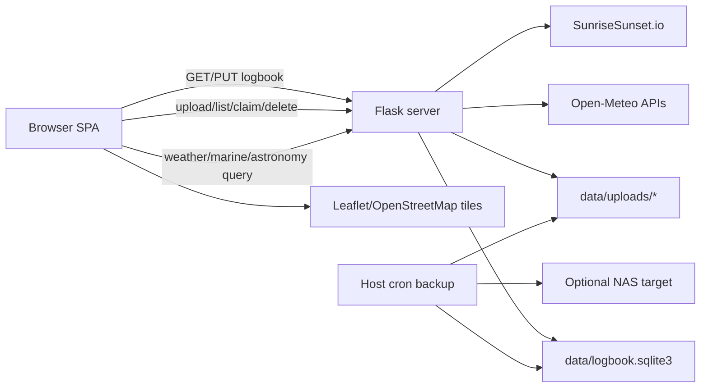

# Architecture

## System Context

Selfhostable Fishing Logbook is a small single-process web application for one trusted operator or household. Flask serves a plain-JavaScript single-page interface, proxies environmental APIs, and reads/writes a SQLite logbook. Uploaded media stays on the local filesystem.

```mermaid
flowchart LR
  Browser["Browser SPA"] -->|"GET/PUT logbook"| Flask["Flask server"]
  Browser -->|"upload/list/claim/delete"| Flask
  Browser -->|"weather/marine/astronomy query"| Flask
  Flask --> SQLite["data/logbook.sqlite3"]
  Flask --> Media["data/uploads/*"]
  Flask --> OM["Open-Meteo APIs"]
  Flask --> SS["SunriseSunset.io"]
  Browser --> Tiles["Leaflet/OpenStreetMap tiles"]
  Backup["Host cron backup"] --> SQLite
  Backup --> Media
  Backup --> NAS["Optional NAS target"]
```

## Runtime Components

### Frontend

`templates/index.html` composes routed screens, dialogs, and row templates from feature partials under `templates/partials/`. Flask renders the composition at request time. `standalone.html` is a generated copy for direct-file fallback, reached through the small root `index.html` bootstrap. Scripts are loaded as classic global scripts in dependency order; there are no modules, package manager, compilation, or bundling.

- `app-state.js`, `app-normalization.js`, `app-units.js`, `app-persistence.js`: shared state, v2 validation, measurement display, and load/save behavior.
- `app.js`, `app-control-events.js`, `app-delegated-events.js`: route/view startup plus direct and delegated event wiring.
- `trip-editor.js`, `trip-rows.js`, `trip-save.js`, `form-utils.js`, `trolling-spread.js`: trip lifecycle, repeated catch/setup rows, persistence, and method-specific fishing behavior.
- `locations.js`, `location-weather.js`: mapped locations and environmental enrichment.
- `photos.js`, `gallery.js`: metadata extraction, upload assignment, gallery, cleanup.
- `gear-core.js`, `gear-pickers.js`, `gear-dialogs.js`, `gear-inventory.js`: gear media/naming, custom selectors, editor workflows, and inventory rendering.
- `dashboard.js`, `stats-scope.js`, `stats-performance.js`, `stats.js`, `stats-rendering.js`: trip lists, analytics scoping/calculation, page composition, and reusable chart/table rendering.
- `maps.js`, `trip-summary.js`, `trip-report.js`, `trip-timeline.js`: global/trip maps, summary detail rendering, report rendering, and summary dialog/media interactions.
- `settings-core.js`, `settings.js`, `settings-fields.js`, `settings-locations.js`: preference orchestration, import/export, editable option groups, and mapped private locations/spots.

Shared mutable globals couple these files. HTML IDs/classes are effectively internal APIs.

### Backend

`server.py` creates the Flask app and owns HTTP routing. Helpers are separated by concern:

- `logbook_store.py`: v2 whole-document validation and SQLite I/O.
- `media_service.py`: upload paths, metadata sidecars, preview generation, references, gallery, orphans.
- `weather_service.py`: allowlisted external weather, marine, and astronomy proxies.
- `bathymetry_service.py`: catch-depth lookup and lake-calibration support.
- `great_lakes_service.py`: Great Lakes temperature, current, raster, and thermocline payloads.
- `request_security.py`: session-backed CSRF protection for mutating requests.
- `backend_config.py`: paths, defaults, units, media categories, external URLs, allowlists.

The Flask development server runs threaded. SQLite writes are transactional, but concurrent whole-logbook saves remain last-write-wins.

### Persistence

The application stores its logbook in `data/logbook.sqlite3`. Top-level collections such as `lures`, `locations`, and `trips` are individual SQLite rows with ordered JSON payloads, preserving their nested setup, catches, people references, weather snapshots, and media references.

Media files are stored separately by category. Each file may have `<filename>.json` metadata and `_previews/<stem>.jpg`. Archive export includes the v2 logbook and media binaries in one ZIP.

## Request and State Flows

### Startup and save

1. The browser requests `/api/logbook`.
2. Flask validates the v2 SQLite document and returns it without runtime reshaping.
3. The browser validates the v2 document and renders all views.
4. A mutation updates in-memory state.
5. `saveState()` validates, writes localStorage, then replaces the complete server document with `PUT /api/logbook`.

If the database cannot be opened or contains an unsupported document, Flask still
serves the normal shell with a degraded-mode warning. The browser uses its valid
cached document when available, otherwise the browser's built-in starter state. The
original database is left untouched, and ordinary saves return `503` until an
explicit archive import repairs the storage.

When opened via `file:`, step 5 stops after localStorage. This is fallback persistence, not feature-complete offline operation.

### Trip weather

1. A selected launch or waterbody supplies coordinates.
2. The browser selects forecast for dates on/after today and archive otherwise.
3. Flask forwards allowlisted query keys to Open-Meteo; marine and astronomy use separate proxies.
4. The browser reduces raw series to trip-window summaries, trends, marine snapshot, sun/moon, and nearest-hour catch weather.
5. Trip save remains successful if enrichment fails; an error/missing status is stored.

### Media

1. The browser parses supported EXIF/QuickTime metadata.
2. Multipart upload sends the file and JSON metadata.
3. Flask validates category/extension, assigns a UUID filename, creates an image preview when possible, and writes a sidecar.
4. The returned reference is embedded in the logbook document.
5. Queue claim moves the file to a final category. Orphan detection compares disk items with recursive logbook references.

## Routing

Flask serves the same SPA at `/`, `/trips`, `/expeditions`, `/bests`, `/stats`, `/leaderboard`, `/map`, `/gear`, `/gallery`, `/checklists`, and `/settings`. The initial view is selected from `window.location.pathname`; `/` selects Trips. In-page navigation only toggles panels: it does not update the URL or handle back/forward navigation. Static files are served only through the restricted `/static/<path>` route.

## Security and Trust Boundary

All routes are unauthenticated. Any network client that can reach the process can read/replace the complete logbook, upload files, enumerate media, and delete eligible files. The intended boundary is the host or a trusted network/reverse proxy.

Current protections include session-backed CSRF tokens for mutations, path resolution, `secure_filename`, upload-category and extension allowlists, coordinate/date checks on proxies, and a referenced-media deletion guard. There is no account/authorization model, rate limiting, or application-level content-size cap.

## Deployment and Automation

Local Python defaults to `127.0.0.1:8080`. Docker listens on `0.0.0.0:8080` inside the container and publishes it to `127.0.0.1:8080` on the host by default, mounts `./data`, and restarts unless stopped. Set `APP_PORT` when a different loopback proxy target is required. Backups are host-managed; this repository has no backup scheduler or restore tool. No in-process background worker or scheduler exists.
