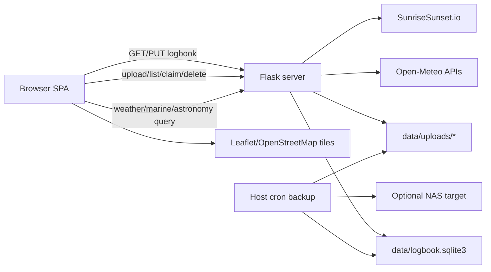

# Architecture

## System Context

Selfhostable Fishing Logbook is a small single-process web application for one trusted operator or household. Flask serves a plain-JavaScript single-page interface, proxies environmental APIs, and reads/writes a SQLite logbook. Uploaded media stays on the local filesystem.

```mermaid
flowchart LR
  Browser["Browser SPA"] -->|"GET/PUT logbook"| Flask["Flask server"]
  Browser -->|"upload/list/claim/delete"| Flask
  Browser -->|"weather/marine/astronomy query"| Flask
  Flask --> SQLite["data/logbook.sqlite3"]
  Flask --> Media["data/uploads/*"]
  Flask --> OM["Open-Meteo APIs"]
  Flask --> SS["SunriseSunset.io"]
  Browser --> Tiles["Leaflet/OpenStreetMap tiles"]
  Backup["Host cron backup"] --> SQLite
  Backup --> Media
  Backup --> NAS["Optional NAS target"]
```

## Runtime Components

### Frontend

`templates/index.html` composes routed screens, dialogs, and row templates from feature partials under `templates/partials/`. Flask renders the composition at request time and links the built bundle through `asset_url()` (content-hashed URLs from `static/dist/manifest.json`). `standalone.html` is generated from the same template for direct-file fallback, reached through the small root `index.html` bootstrap.

The browser code is ES modules under `static/js/`, bundled by esbuild (`npm run build`) with Leaflet, esri-leaflet, html2canvas, and the Roboto font from npm; no CDN is used. `main.js` imports every module and then calls each module's `setup()` (event wiring and other load-time work) in a fixed order.

- `app-state.js`: the read-only `state` document plus `ui` for UI-only state. `store.js`: the only writer ? `commit(mutate)` validates a changed copy against the shared schema, saves the whole document with `PUT /api/logbook` and `If-Match` (skipping the request when nothing changed) and installs it; `replaceState` installs server documents. `actions.js`: named domain changes (trips, gear with reference cleanup, locations, expeditions, checklists, spots, settings). Development/test bundles deep-freeze `state`; ESLint rejects mutations of it.
- `app-normalization.js`, `app-defaults.js`: validation and defaults from the generated shared-schema module `generated/logbook-schema-rules.js`. `app-units.js`: measurement display and unit conversion.
- `html.js`: the auto-escaping `html` tagged template, `joinHtml`, and `setHtml`/`insertHtml` ? the only way markup reaches the DOM (ESLint forbids direct `innerHTML`).
- `router.js`: keeps the URL in sync with the visible view (`pushState`, `popstate`, reload keeps the view).
- `app.js`, `app-control-events.js`, `app-delegated-events.js`: startup plus direct and delegated event wiring.
- Editing forms are draft-driven. The trip editor (`trip-editor.js`, `trip-rows.js`, `trip-save.js`, `form-utils.js`, `trolling-spread.js`) keeps `ui.tripDraft`, gear dialogs keep `ui.gearDraft`, and settings editors keep drafts on `settingsUi`. `draft-binding.js` is the only code that reads control values (from the input/change event) and writes them into the draft; programmatic changes use its helpers (`updateTripField`, `updateTripRow`, `insertTripRow`, `removeTripRow`, `replaceTripRows`, and the gear/settings equivalents) and re-render from the draft. Options, labels, visibility, and estimates are computed from drafts. Saves build records only from drafts through pure, source-aware normalizers (`trip-draft.js`, `gear-draft.js`, `settings-draft.js`) that keep untouched fields, additive properties, and absent optional fields exactly as stored. `tests/trip-draft-guards.test.mjs` and `tests/control-read-guard.test.mjs` enforce this.
- `locations.js`, `location-weather.js`: mapped locations and environmental enrichment.
- `photos.js`, `gallery.js`: metadata extraction, upload assignment, gallery, cleanup.
- `gear-core.js`, `gear-pickers.js`, `gear-dialogs.js`, `gear-draft.js`, `gear-inventory.js`: gear media/naming, custom selectors, draft-driven editor dialogs and their normalizers, inventory rendering.
- `dashboard.js`, `stats-*.js`, `leaderboard.js`, `personal-bests.js`: trip lists and analytics.
- `maps.js`, `trip-summary.js`, `trip-report.js`, `trip-timeline.js`, `trip-sharing.js`: maps, summaries, reports, sharing.
- `settings-core.js`, `settings.js`, `settings-fields.js`, `settings-locations.js`, `settings-draft.js`, `saved-setups.js`, `checklists.js`: preferences, import/export, editable option groups, spots and private locations, all draft-driven with autosave built from their drafts.

HTML IDs/classes and `data-*` attributes remain internal APIs shared by templates, renderers, CSS, and tests.

### Backend

`server.py` is only the entry point: it builds an `AppConfig` from the environment once (`backend/config.py`) and calls `create_app(config)` in `backend/app_factory.py`. Tests and tools pass their own `AppConfig` instead of patching module globals.

- `backend/routes/`: Flask blueprints ? `pages` (SPA shell, static files, health, CSRF token), `logbook` (document, record changes, archives, Shared Trip ZIPs), `media` (uploads, gallery, orphans, photo queue), `environment` (weather, marine, astronomy, bathymetry, Great Lakes). Routes contain no storage-backend branches.
- `backend/storage/`: the `LogbookStore` and `MediaStore` interfaces (`base.py`), chosen once by `create_storage(config)`. `local.py` is SQLite plus the on-disk uploads tree; `cloud.py` holds the unchanged Cloudflare Worker behaviour and is only selected when `FISH_STORAGE_BACKEND=cloud` and `FISH_CLOUD_API_URL` are set. `media_transaction.py` stages, promotes, and rolls back file operations for archive import, Shared Trip import, and photo-queue claim/copy.
- `logbook_store.py`: v2 validation ? the shared JSON Schema (`schema/logbook.schema.json`) plus semantic rules JSON Schema cannot express.
- `logbook_repository.py`: SQLite I/O and revisions.
- `archive_service.py`: whole-logbook archive export and import validation. `shared_trip_archive.py`: one-trip Shared Trip ZIPs.
- `media_service.py`: `UploadLibrary` (paths, sidecars, previews for one uploads tree) and pure media helpers (references, captions, EXIF, HEIF conversion, private-location scrubbing).
- `weather_service.py`, `bathymetry_service.py`, `great_lakes_service.py`: external data proxies. Great Lakes caches are bounded by time bucket and entry count.
- `request_security.py`: session-backed CSRF protection for mutating requests.
- `backend_config.py`: static constants, loaded from `schema/constants.json` and `schema/default-logbook.json` where shared with the browser and mobile app. `frontend_assets.py` resolves the built bundle URLs.

Flask runs threaded locally and under gunicorn (2 workers) in Docker. Concurrent saves are safe: every write carries the revision it was based on and a stale write is refused with `412` instead of silently overwriting (last-write-wins no longer applies).

### Persistence

The application stores its logbook in `data/logbook.sqlite3`. Top-level collections such as `lures`, `locations`, and `trips` are individual SQLite rows with ordered JSON payloads, preserving their nested setup, catches, people references, weather snapshots, and media references. `settings`, the schema version, a monotonically increasing `revision`, and unknown top-level properties are stored as metadata rows. The validated document is cached in memory per revision, so reads that only need the current document (page theme, captions, reference guards) do not re-parse or re-validate SQLite.

Media files are stored separately by category. Each file may have `<filename>.json` metadata and `_previews/<stem>.jpg`. Archive export includes the v2 logbook and media binaries in one ZIP.

## Request and State Flows

### Startup and save

1. The browser requests `/api/logbook`.
2. Flask validates the v2 SQLite document and returns it without runtime reshaping.
3. The browser validates the v2 document and renders all views.
4. A mutation updates in-memory state.
5. `store.commit(mutate)` applies the change to a copy, validates it against the shared schema, saves the whole document with `PUT /api/logbook` and `If-Match`, and only then installs the copy as the new state and caches it in localStorage. A `412` means another tab or device saved first; the browser keeps its last persisted state and asks the user to reload.

If the database cannot be opened or contains an unsupported document, Flask still
serves the normal shell with a degraded-mode warning. The browser uses its valid
cached document when available, otherwise the browser's built-in starter state. The
original database is left untouched, and ordinary saves return `503` until an
explicit archive import repairs the storage.

When opened via `file:`, commits skip the server and only update localStorage. This is fallback persistence, not feature-complete offline operation.

### Trip weather

1. A selected launch or waterbody supplies coordinates.
2. The browser selects forecast for dates on/after today and archive otherwise.
3. Flask forwards allowlisted query keys to Open-Meteo; marine and astronomy use separate proxies.
4. The browser reduces raw series to trip-window summaries, trends, marine snapshot, sun/moon, and nearest-hour catch weather.
5. Trip save remains successful if enrichment fails; an error/missing status is stored.

### Media

1. The browser parses supported EXIF/QuickTime metadata.
2. Multipart upload sends the file and JSON metadata.
3. Flask validates category/extension, assigns a UUID filename, creates an image preview when possible, and writes a sidecar.
4. The returned reference is embedded in the logbook document.
5. Queue claim moves the file to a final category. Orphan detection compares disk items with recursive logbook references.

## Routing

Flask serves the same SPA at `/`, `/trips`, `/expeditions`, `/bests`, `/stats`, `/leaderboard`, `/map`, `/gear`, `/gallery`, `/checklists`, `/wiki`, and `/settings`. The initial view is selected from `window.location.pathname`; `/` selects Trips and is normalized into history state on load. `static/js/router.js` owns the client route table. Primary in-app navigation calls `navigate(view)`, which renders the panel and pushes the matching path when the path changes; `popstate` re-renders the matching panel without pushing. Stats filters continue to own the `/stats` query string, and same-view navigation preserves the current query. In `file://` standalone fallback mode, navigation renders panels without pushing absolute server paths. Static files are served only through the restricted `/static/<path>` route.

## Security and Trust Boundary

All routes are unauthenticated. Any network client that can reach the process can read/replace the complete logbook, upload files, enumerate media, and delete eligible files. The intended boundary is the host or a trusted network/reverse proxy.

Current protections include session-backed CSRF tokens for mutations, path resolution, `secure_filename`, upload-category and extension allowlists, coordinate/date checks on proxies, and a referenced-media deletion guard. There is no account/authorization model, rate limiting, or application-level content-size cap.

## Deployment and Automation

Local Python defaults to `127.0.0.1:8080`. Docker listens on `0.0.0.0:8080` inside the container and publishes it to `127.0.0.1:8080` on the host by default, mounts `./data`, and restarts unless stopped. Set `APP_PORT` when a different loopback proxy target is required. Backups are host-managed; this repository has no backup scheduler or restore tool. No in-process background worker or scheduler exists.
