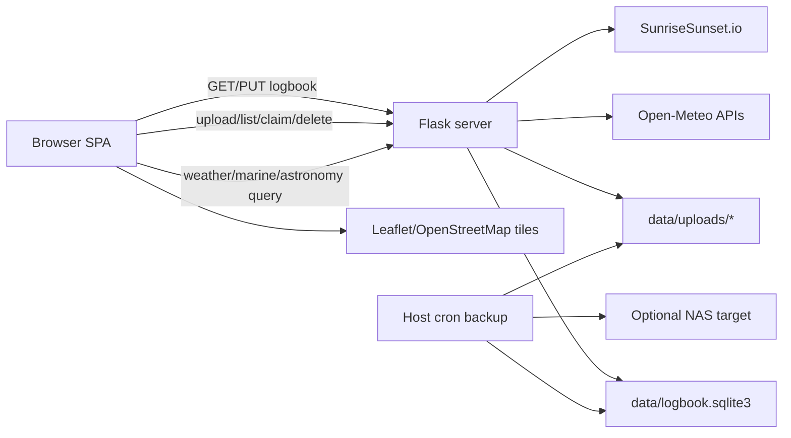

# Architecture

## System Context

Selfhostable Fishing Logbook is a small single-process web application for one trusted operator or household. Flask serves a plain-JavaScript single-page interface, proxies environmental APIs, and reads/writes a SQLite logbook. Uploaded media stays on the local filesystem.

```mermaid
flowchart LR
  Browser["Browser SPA"] -->|"GET/PUT logbook"| Flask["Flask server"]
  Browser -->|"upload/list/claim/delete"| Flask
  Browser -->|"weather/marine/astronomy query"| Flask
  Flask --> SQLite["data/logbook.sqlite3"]
  Flask --> Media["data/uploads/*"]
  Flask --> OM["Open-Meteo APIs"]
  Flask --> SS["SunriseSunset.io"]
  Browser --> Tiles["Leaflet/OpenStreetMap tiles"]
  Backup["Host cron backup"] --> SQLite
  Backup --> Media
  Backup --> NAS["Optional NAS target"]
```

## Runtime Components

### Frontend

`templates/index.html` composes routed screens, dialogs, and row templates from feature partials under `templates/partials/`. Flask renders the composition at request time and links the built bundle through `asset_url()` (content-hashed URLs from `static/dist/manifest.json`). `standalone.html` is generated from the same template for direct-file fallback, reached through the small root `index.html` bootstrap.

The browser code is ES modules under `static/js/`, bundled by esbuild (`npm run build`) with Leaflet, esri-leaflet, html2canvas, and the Roboto font from npm; no CDN is used. `main.js` imports every module and then calls each module's `setup()` (event wiring and other load-time work) in a fixed order.

- `app-state.js`: the read-only `state` document plus `ui` for UI-only state. `store.js`: the only writer ? `commit(mutate)` validates a changed copy against the shared schema, saves the whole document with `PUT /api/logbook` and `If-Match` (skipping the request when nothing changed) and installs it; `replaceState` installs server documents. `actions.js`: named domain changes (trips, gear with reference cleanup, locations, expeditions, checklists, spots, settings). Development/test bundles deep-freeze `state`; ESLint rejects mutations of it.
- `app-normalization.js`, `app-defaults.js`: validation and defaults from the generated shared-schema module `generated/logbook-schema-rules.js`. `app-units.js`: measurement display and unit conversion.
- `html.js`: the auto-escaping `html` tagged template, `joinHtml`, and `setHtml`/`insertHtml` ? the only way markup reaches the DOM (ESLint forbids direct `innerHTML`).
- `router.js`: keeps the URL in sync with the visible view (`pushState`, `popstate`, reload keeps the view).
- `app.js`, `app-control-events.js`, `app-delegated-events.js`: startup plus direct and delegated event wiring.
- Editing forms are draft-driven. The trip editor (`trip-editor.js`, `trip-rows.js`, `trip-save.js`, `form-utils.js`, `trolling-spread.js`) keeps `ui.tripDraft`, gear dialogs keep `ui.gearDraft`, and settings editors keep drafts on `settingsUi`. `draft-binding.js` is the only code that reads control values (from the input/change event) and writes them into the draft; programmatic changes use its helpers (`updateTripField`, `updateTripRow`, `insertTripRow`, `removeTripRow`, `replaceTripRows`, and the gear/settings equivalents) and re-render from the draft. Options, labels, visibility, and estimates are computed from drafts. Saves build records only from drafts through pure, source-aware normalizers (`trip-draft.js`, `gear-draft.js`, `settings-draft.js`) that keep untouched fields, additive properties, and absent optional fields exactly as stored. `tests/trip-draft-guards.test.mjs` and `tests/control-read-guard.test.mjs` enforce this.
- `locations.js`, `location-weather.js`: mapped locations and environmental enrichment.
- `photos.js`, `gallery.js`: metadata extraction, upload assignment, gallery, cleanup.
- `gear-core.js`, `gear-pickers.js`, `gear-dialogs.js`, `gear-draft.js`, `gear-inventory.js`: gear media/naming, custom selectors, draft-driven editor dialogs and their normalizers, inventory rendering.
- `dashboard.js`, `stats-*.js`, `leaderboard.js`, `personal-bests.js`: trip lists and analytics.
- `maps.js`, `trip-summary.js`, `trip-report.js`, `trip-timeline.js`, `trip-sharing.js`: maps, summaries, reports, sharing.
- `settings-core.js`, `settings.js`, `settings-fields.js`, `settings-locations.js`, `settings-draft.js`, `saved-setups.js`, `checklists.js`: preferences, import/export, editable option groups, spots and private locations, all draft-driven with autosave built from their drafts.

HTML IDs/classes and `data-*` attributes remain internal APIs shared by templates, renderers, CSS, and tests.

### Backend

`server.py` is only the entry point: it builds an `AppConfig` from the environment once (`backend/config.py`) and calls `create_app(config)` in `backend/app_factory.py`. Tests and tools pass their own `AppConfig` instead of patching module globals.

- `backend/routes/`: Flask blueprints ? `pages` (SPA shell, static files, health, CSRF token), `logbook` (document, record changes, archives, Shared Trip ZIPs), `media` (uploads, gallery, orphans, photo queue), `environment` (weather, marine, astronomy, bathymetry, Great Lakes). Routes contain no storage-backend branches.
- `backend/storage/`: the `LogbookStore` and `MediaStore` interfaces (`base.py`), chosen once by `create_storage(config)`. `local.py` is SQLite plus the on-disk uploads tree; `cloud.py` holds the unchanged Cloudflare Worker behaviour and is only selected when `FISH_STORAGE_BACKEND=cloud` and `FISH_CLOUD_API_URL` are set. `media_transaction.py` stages, promotes, and rolls back file operations for archive import, Shared Trip import, and photo-queue claim/copy.
- `logbook_store.py`: v2 validation ? the shared JSON Schema (`schema/logbook.schema.json`) plus semantic rules JSON Schema cannot express.
- `logbook_repository.py`: SQLite I/O and revisions.
- `archive_service.py`: whole-logbook archive export and import validation. `shared_trip_archive.py`: one-trip Shared Trip ZIPs.
- `media_service.py`: `UploadLibrary` (paths, sidecars, previews for one uploads tree) and pure media helpers (references, captions, EXIF, HEIF conversion, private-location scrubbing).
- `weather_service.py`, `bathymetry_service.py`, `great_lakes_service.py`: external data proxies. Great Lakes layers are built from cached NOAA volumes (`great_lakes_volumes.py`, `great_lakes_cache.py`), drawn by `great_lakes_render.py`, and kept current by `great_lakes_refresher.py` (see [Great Lakes data refresh](#great-lakes-data-refresh)); `great_lakes_observations.py` serves live NOAA buoy readings; `great_lakes_waves.py` (with the pure-Python GRIB2 reader `grib2.py`) serves the NOAA GLWU wave layer.
- `request_security.py`: session-backed CSRF protection for mutating requests.
- `backend_config.py`: static constants, loaded from `schema/constants.json` and `schema/default-logbook.json` where shared with the browser and mobile app. `frontend_assets.py` resolves the built bundle URLs.

Flask runs threaded locally and under gunicorn (2 workers) in Docker. Concurrent saves are safe: every write carries the revision it was based on and a stale write is refused with `412` instead of silently overwriting (last-write-wins no longer applies).

### Persistence

The application stores its logbook in `data/logbook.sqlite3`. Top-level collections such as `lures`, `locations`, and `trips` are individual SQLite rows with ordered JSON payloads, preserving their nested setup, catches, people references, weather snapshots, and media references. `settings`, the schema version, a monotonically increasing `revision`, and unknown top-level properties are stored as metadata rows. The validated document is cached in memory per revision, so reads that only need the current document (page theme, captions, reference guards) do not re-parse or re-validate SQLite.

Media files are stored separately by category. Each file may have `<filename>.json` metadata and `_previews/<stem>.jpg`. Archive export includes the v2 logbook and media binaries in one ZIP.

## Request and State Flows

### Startup and save

1. The browser requests `/api/logbook`.
2. Flask validates the v2 SQLite document and returns it without runtime reshaping.
3. The browser validates the v2 document and renders all views.
4. A mutation updates in-memory state.
5. `store.commit(mutate)` applies the change to a copy, validates it against the shared schema, saves the whole document with `PUT /api/logbook` and `If-Match`, and only then installs the copy as the new state and caches it in localStorage. A `412` means another tab or device saved first; the browser keeps its last persisted state and asks the user to reload.

If the database cannot be opened or contains an unsupported document, Flask still
serves the normal shell with a degraded-mode warning. The browser uses its valid
cached document when available, otherwise the browser's built-in starter state. The
original database is left untouched, and ordinary saves return `503` until an
explicit archive import repairs the storage.

When opened via `file:`, commits skip the server and only update localStorage. This is fallback persistence, not feature-complete offline operation.

### Trip weather

1. A selected launch or waterbody supplies coordinates.
2. The browser selects forecast for dates on/after today and archive otherwise.
3. Flask forwards allowlisted query keys to Open-Meteo; marine and astronomy use separate proxies.
4. The browser reduces raw series to trip-window summaries, trends, marine snapshot, sun/moon, and nearest-hour catch weather.
5. Trip save remains successful if enrichment fails; an error/missing status is stored.

### Great Lakes current inspection

1. The operator selects a lake, the Underwater currents layer, a forecast time, and a map depth. `great-lakes-conditions.js` renders the available flow overlay.
2. A map press opens the depth popup in `maps.js`. Bathymetry fills in FOW when available; the popup also offers **View current profile** and omits the point's coordinates.
3. That button requests `GET /api/great-lakes/current-profile` for the selected point and forecast. `great_lakes_service.py` chooses a nearby model point and returns available depths, velocity, speed, and flow direction.
4. The dialog orders the readings from shallow to deep and shades the row nearest the selected map depth. The popup and profile are derived views; they do not change the logbook document.

### Media

1. The browser parses supported EXIF/QuickTime metadata.
2. Multipart upload sends the file and JSON metadata.
3. Flask validates category/extension, assigns a UUID filename, creates an image preview when possible, and writes a sidecar.
4. The returned reference is embedded in the logbook document.
5. Queue claim moves the file to a final category. Orphan detection compares disk items with recursive logbook references.

### Great Lakes data refresh

NOAA runs each Great Lakes Operational Forecast System (LSOFS for Superior, LMHOFS for Michigan–Huron, LEOFS for Erie, LOOFS for Ontario) four times a day, at 00, 06, 12, and 18 UTC. Each run holds hourly frames out to 120 hours. A run's final frame reaches the CO-OPS THREDDS server a consistent delay after the cycle time (measured October 2026): about 2 h 35 m for Erie, 2 h 47 m for Ontario, 3 h 21 m for Michigan–Huron, and 3 h 25 m for Superior. Between runs nothing new is published; "Now" is the run's frame nearest the current hour, so it advances hourly within the same run.

1. Discovery only uses complete runs (the f120 frame exists), falling back to the previous day's catalog during a partial 00z run, and keeps the last good run if NOAA is unreachable. Results are shared through `runs.json`.
2. One binary OPeNDAP download per model-hour (`.dods`, every depth level) is stored on disk as a temperature volume and a velocity volume. Every depth on the slider, the thermocline, the current field, and the speed and temperature rasters are derived from those two files. A model's grid coordinates and wet mask never change, so they are downloaded once and left out of later requests; file structure and depth levels are looked up once per run.
3. When the server runs with `GREAT_LAKES_BACKGROUND_REFRESH` on, one process holds `refresher.lock` and:
   - checks for a new run every 5 minutes from 10 minutes before to 2 hours after each model's expected publication, and every 30 minutes otherwise;
   - downloads every forecast choice ("Now", 6, 12, 24, and 48 h) for every lake at every depth (about 45 MB per choice, roughly 180 MB an hour) whenever a run arrives or "Now" moves to the next hour, "Now" first; precomputes their thermoclines; and deletes older runs and hours the map no longer shows;
   - draws the map's all-lakes layers (temperature, thermocline, and currents at full detail) for "Now" at every depth level down to 30 m (about 100 ft) and for each forecast at the surface, so they open without waiting;
   - downloads the static model meshes and water masks once;
   - keeps the wave layer current (see [Great Lakes waves](#great-lakes-waves)) before the slower GLOFS work in each pass.
   Requests for anything not prepared (for example another depth before its hour is warm, or with background refresh off) fetch only the displayed depth level first (about 0.2–0.4 MB per lake), then the full volume in the background; both stay cached until the next run. Drawn layers are stored on disk (`rendered/`) for every worker and dropped after three hours. Buoy observations are small and are fetched live on each request instead (most stations report hourly, about 25 minutes after the hour; an open map refetches them every 10 minutes). Other gunicorn workers read the same disk cache and take over the lock if the leader exits.
4. `GET /api/great-lakes/status` reports the run and hour being served and when the next run is expected. An open map polls it every 5 minutes (and when the tab becomes visible) and reloads the layer only when that version changes. Layers always cover all four lakes at one fixed resolution, so panning and zooming never request new data; requested depths are snapped to the nearest model level before cache lookup. Layer requests carry the version so the browser's HTTP cache never returns an older frame.

### Great Lakes upwelling and downwelling

The "Upwelling & downwelling" layer (`great_lakes_upwelling.py`, shared with the Great Lakes Trolling site) marks where a shore's surface water is being replaced. NOAA's lake models publish no wind or vertical motion, so it is worked out from the temperature volumes the map already downloads: blue (upwelling) where the surface is clearly colder than the open water (at least 10 m deep) within about 25 km, and more so if it cooled over the last 24 hours; red (downwelling) where it is warmer than its surroundings, warmed over the day, or the thermocline sits much deeper. Only patches of at least 20 km² that reach within 10 km of a shore are marked, on a fixed ±8 °F scale. The surface 24 hours earlier is one level downloaded from the model run one day older at the same forecast hour. `/api/great-lakes/upwelling-raster` draws it and `/api/great-lakes/upwelling-value` explains a point.

### Great Lakes past 90 days

Forecast animation matches a water-temperature background to each current frame by forecast hour rather than by list position. Frame events include the corresponding temperature metadata. Measurement stations are hidden while animation is active, including when paused, and restored on stop without changing the user's stations setting.

Playing starts the next image's linear fade immediately, lasts for the entire frame interval, and starts the following fade without a hold. Older images are hidden instantly at the handoff so their cleanup cannot fade the map through. Current particles keep their trails and interpolate the eastward/northward velocity between the adjacent forecast grids. Reduced motion keeps discrete frame steps.

The map's "Past 90 days" choice offers only the timestamps the website has saved, currently four samples per day (six hours apart): each layer's surface map, point readings and water-column profiles (with the thermocline), and station readings, plus a 90-day chart in each station popup. The desktop app does not keep this history locally: `great_lakes_history_client.py` requests it from the Great Lakes Trolling site's public API (`GREAT_LAKES_HISTORY_URL`, default `https://greatlakestrolling.com`). The `/api/great-lakes/history/...` routes pass JSON through, serve the website's saved map images through this app, and keep only recent responses in memory. Historical data needs a connection to the site.

### Great Lakes waves

GLOFS has no waves, so the wave layer uses the National Weather Service's Great Lakes Wave Unstructured model (GLWU, WAVEWATCH III), the operational guidance behind NWS Great Lakes marine forecasts. NCEP runs it every hour with hourly frames out to 48 hours on a 2.5 km Lambert conformal grid covering all five lakes, and publishes it on NOMADS (`glwu.YYYYMMDD/glwu.grlc_2p5km_sr.tHHz.grib2`) only as GRIB2, since NOMADS retired OPeNDAP in 2025. A cycle usually appears a few minutes after the hour; the longer 01, 07, 13, and 19 UTC runs appear about 30 minutes after.

1. `great_lakes_waves.py` reads each cycle's `.idx` inventory, uses the newest cycle whose 48-hour frame is listed, and shares it through `waves-run.json` (keeping the last good cycle if NOMADS is unreachable).
2. For each forecast choice it downloads only three fields with HTTP Range requests (about 140 KB per hour instead of the 24 MB file): significant wave height (HTSGW), primary wave period (PERPW), and primary wave direction (DIRPW, the direction waves come from). `grib2.py` decodes them in pure Python (Lambert conformal and lat/lon grids; simple, complex, and spatially differenced complex packing). Decoded hours are cached under `waves/<cycle>/`.
3. Wave height is resampled onto each lake's temperature raster grid and drawn by `great_lakes_render.py`, so it has the same fine NOAA shoreline as the other layers. The colour scale runs from calm (0) to the highest height shown, never less than 1 m. The payload also carries direction arrows sampled every 4th model cell, which the browser thins to an even screen spacing on every pan or zoom.
4. The refresher checks for a new cycle every 5 minutes and downloads and draws every forecast choice whenever a cycle arrives or "Now" moves to the next hour. `/api/great-lakes/status` reports it separately as `waves` and `wavesVersion`, so a new wave cycle reloads only the wave layer.

## Routing

Flask serves the same SPA at `/`, `/trips`, `/expeditions`, `/bests`, `/stats`, `/leaderboard`, `/map`, `/gear`, `/gallery`, `/checklists`, `/wiki`, and `/settings`. The initial view is selected from `window.location.pathname`; `/` selects Trips and is normalized into history state on load. `static/js/router.js` owns the client route table. Primary in-app navigation calls `navigate(view)`, which renders the panel and pushes the matching path when the path changes; `popstate` re-renders the matching panel without pushing. Stats filters continue to own the `/stats` query string, and same-view navigation preserves the current query. In `file://` standalone fallback mode, navigation renders panels without pushing absolute server paths. Static files are served only through the restricted `/static/<path>` route.

## Security and Trust Boundary

All routes are unauthenticated. Any network client that can reach the process can read/replace the complete logbook, upload files, enumerate media, and delete eligible files. The intended boundary is the host or a trusted network/reverse proxy.

Current protections include session-backed CSRF tokens for mutations, path resolution, `secure_filename`, upload-category and extension allowlists, coordinate/date checks on proxies, and a referenced-media deletion guard. There is no account/authorization model, rate limiting, or application-level content-size cap.

## Deployment and Automation

Local Python defaults to `127.0.0.1:8080`. Docker listens on `0.0.0.0:8080` inside the container and publishes it to `127.0.0.1:8080` on the host by default, mounts `./data`, and restarts unless stopped. Set `APP_PORT` when a different loopback proxy target is required. Backups are host-managed; this repository has no backup scheduler or restore tool. No in-process background worker or scheduler exists.

### NOAA publication freshness

Run discovery accepts partial regular-grid cycles. Each requested time uses the
newest cycle containing that exact hour, retaining older cycles for forecasts
still being published. Cache keys and status versions include selected coverage.
Source checks run independently of the single background preparation job, so
downloading and drawing cannot delay detection of newer NOAA files.

Incomplete thermocline updates retain the last complete layer and its original
valid time. Availability metadata distinguishes a delayed fallback, waiting
without a saved layer, and an outage lasting three hours. Incomplete current
updates can retain the last complete map for the same forecast hour and depth.
These responses use no-store; the map retries them even when the NOAA version
is unchanged.
