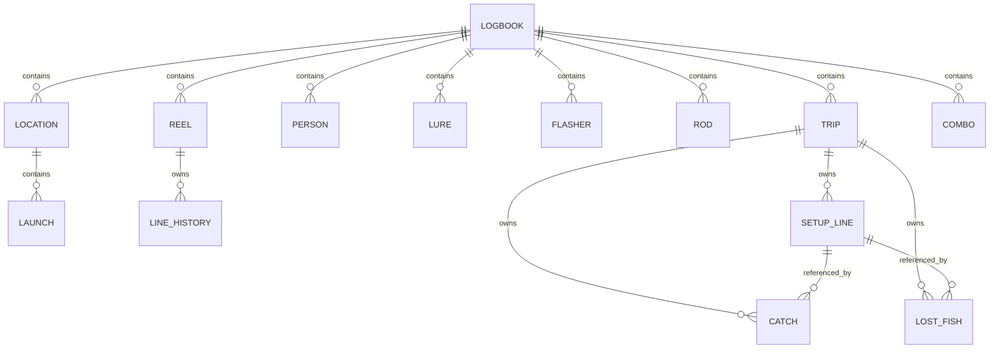

# Data Model

## Storage Model

There are no SQL tables. `data/logbook.json` is one aggregate, versioned JSON document. Schema version 1 is current; unversioned legacy documents migrate to version 1 during normalization. Unknown properties generally survive because normalization is additive rather than a strict serializer.



Relationships are string IDs enforced primarily by UI behavior, not backend referential validation.

## Top-Level Logbook

| Field | Type | Purpose |
|---|---|---|
| `species`, `methods` | string arrays | User-managed form choices. |
| `lureTypes`, `flasherTypes` | string arrays | Gear classification choices. |
| `waterClarities`, `weatherTypes` | string arrays | Manual condition choices. |
| `reelStyles`, `rodTypes`, `lineTypes` | string arrays | Inventory choices. |
| `trollingPresentations` | `{value,label}[]` | Presentation choices. |
| `trollingDirections` | string array | Direction choices. |
| `setupLineSides` | `{value,label}[]` | Port/center/starboard choices. |
| `lures`, `flashers`, `reels`, `rods`, `rodReelCombos` | arrays | Reusable gear libraries. |
| `settings` | object | Time, unit, and chop preferences. |
| `people`, `locations`, `trips` | arrays | Core records. |

Legacy top-level `tripTypes` is removed during normalization.

## Settings

- `timeFormat`: `"12"` or `"24"`.
- `units`: `depth`, `distance`, `speed`, `windSpeed`, `pressure`, `airTemperature`, `waterTemperature`, `precipitation`, `waveHeight`, `fishLength`, `fishWeight`.
- `chopRanges[]`: `{ id, label, maxFeet }`; at least one open-ended `maxFeet: null` range is ensured.

Typed fishing measurements such as `waterTemp`, `weight`, and `fowCaught` are strings. Unit settings alter labels/placeholders and API display conversion; they do not rewrite typed historical values.

## Location and Person

```json
{
  "id": "loc-lake-ontario",
  "name": "Lake Ontario",
  "coordinates": { "latitude": 43.2, "longitude": -79.5 },
  "launches": [
    { "id": "...", "name": "Launch name", "coordinates": { "latitude": 43.2, "longitude": -79.5 } }
  ]
}
```

Coordinates must be within latitude/longitude bounds and cannot be `(0,0)`. String locations from older/imported data are migrated to records without coordinates. A person is `{ id, name }`; people found inside trips are merged into the top-level library.

## Trip

| Group | Verified fields |
|---|---|
| Identity/location | `id`, `title`, `date`, `location`, `locationId`, `launch`, `launchId` |
| Time | `startTime`, `endTime`, `hours` |
| Classification | `targetSpecies`, `method`, `intent`, `tripRating` |
| Conditions | `waterTemp`, `waterClarity`, `weather`, `waveHeight`, `waveChop`, `wind`, `structure` |
| Narrative/media | `notes`, `notePhotos[]` |
| Nested records | `people[]`, `gearUsed[]`, `catches[]`, `lostFish[]` |
| Enrichment | `weatherData` |

An end time earlier than start time is treated as overnight for hours and weather date selection.

## Setup Line (`trip.gearUsed[]`)

`id`, `personId` (currently written as empty), `startTime`, `endTime`, `changeNote`, `side`, `lineLabel`, `comboId`, `rodId`, `reelId`, `lureId`, `flasherId`, `presentation`, `deepestRigger`, `lureMinutes`, and `flasherMinutes`.

Setup rows intentionally do not collect fish-specific speed/depth parameters. Resolver code can read legacy setup-level speed/depth properties if imported, but the current UI does not write them.

## Catch and Lost Fish

Common fields include `id`, `personId`, `time`, `waterDepth`, `depthDown`, `presentation`, `direction`, `fowCaught`, `speed`, `retrieve`, `ballDepth`, `lineBehindBoard`, `estimatedLureDepth`, `dipseySetting`, `lineOut`, `estimatedDepth`, `notes`, `setupLineId`, `lureId`, and `flasherId`.

Landed catches additionally use `species`, `released`, `length`, `weight`, `manualCoordinates`, `coordinates`, `photos[]`, and optional `weatherData`. Lost fish use `possibleSpecies`, force `released: false`, and currently save no photos or coordinates.

An imported numeric `quantity` is honored by analytics, but the form has no quantity input. Current UI-created records therefore represent one fish each.

## Gear Entities

- Lure: `id`, `name`, `type`, `brand`, `color`, `notes`, media fields.
- Flasher: same core shape as lure.
- Rod: `id`, `shortName`, `type`, `brand`, `name`, `length`, `power`, `action`, `lureRating`, `purchaseAmount`, `dateBought`, `notes`, media fields.
- Reel: `id`, `shortName`, `style`, `brand`, `name`, `size`, `weight`, `gearRatio`, `retrieveRate`, `maxDrag`, `monoCapacity`, `braidCapacity`, `purchaseAmount`, `dateBought`, `notes`, media fields, `lineHistory[]`.
- Combo: `id`, `shortName`, `rodId`, `reelId`, `notes`.
- Line history: `id`, `spooledDate`, `discardedDate`, `type`, `brand`, `name`, `weight`, `diameterIn`, `diameterMm`, `color`, `monoBacking`, `notes`.

Media fields written to gear include `image`, `previewImage`, `imagePath`, `imageFilename`, `previewPath`, and `previewFilename`.

## Media Reference and Sidecar

Embedded media may contain `id`, original `name`, `caption`, `filename`, `path`, `url`, `image`, `mediaType`, MIME type, preview fields, `coordinates`, and `captureTime`. The sidecar repeats upload metadata and server-generated media/preview information.

Upload categories are `catch-photos`, `trip-photos`, `lures`, `flashers`, `reels`, `rods`, and `queue`.

## Weather Data

Trip `weatherData` may contain:

- `source`, `fetchedAt`, `timezone`, `units`.
- `daily`: normalized daily conditions.
- `hourly`: trip-window normalized records.
- `tripWindow`: averages/sums/min/max plus barometric trend rate.
- `trend`: deltas and labels.
- `frontTag`.
- `marine`: source/timezone/units/hourly and wave snapshot or unavailable status.
- `sunMoon`: API-backed sunrise/sunset/moon fields.

Catch `weatherData` contains source/fetch/timezone/units and one nearest normalized hourly record. On missing prerequisites or errors, a status/message snapshot may replace the normal structure.

## Normalization and Validation

Backend validation recursively checks JSON value types, schema compatibility, collection and nested-record shapes, duplicate top-level record IDs, settings, units, locations, coordinates, people, and trip child collections. Errors include the failing JSON path.

Normalization supplies defaults, validates unit/time/chop preferences, cleans choice lists, merges people and locations, and reconnects trip location/launch names and IDs. There is no explicit schema-version migration history.
