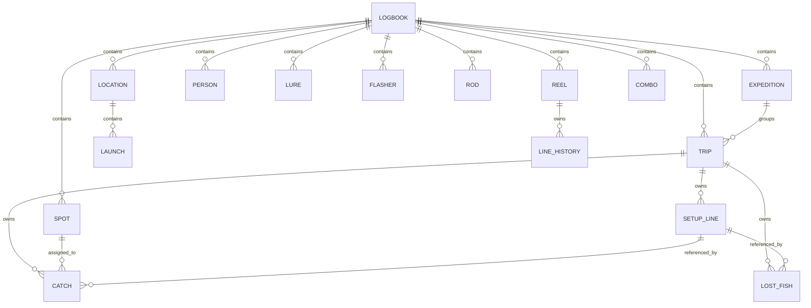

# Data Model

## Storage Model

`data/logbook.sqlite3` stores the canonical version-2 logbook. `logbook_metadata` holds the schema version, settings, and unknown top-level properties. `logbook_entries` stores every top-level collection row with its collection name, stable record ID when present, display position, and JSON payload. Reads, writes, and portable imports validate the canonical schema and preserve stored records without runtime reshaping.


```mermaid
erDiagram
  LOGBOOK ||--o{ TRIP : contains
  LOGBOOK ||--o{ EXPEDITION : contains
  EXPEDITION ||--o{ TRIP : groups
  LOGBOOK ||--o{ LOCATION : contains
  LOCATION ||--o{ LAUNCH : contains
  LOGBOOK ||--o{ SPOT : contains
  LOGBOOK ||--o{ PERSON : contains
  LOGBOOK ||--o{ LURE : contains
  LOGBOOK ||--o{ FLASHER : contains
  LOGBOOK ||--o{ ROD : contains
  LOGBOOK ||--o{ REEL : contains
  LOGBOOK ||--o{ COMBO : contains
  REEL ||--o{ LINE_HISTORY : owns
  TRIP ||--o{ SETUP_LINE : owns
  TRIP ||--o{ CATCH : owns
  SPOT ||--o{ CATCH : assigned_to
  TRIP ||--o{ LOST_FISH : owns
  SETUP_LINE ||--o{ CATCH : referenced_by
  SETUP_LINE ||--o{ LOST_FISH : referenced_by
```

Relationships are string IDs enforced primarily by UI behavior, not backend referential validation.

## Desktop/Mobile Interchange

The desktop SQLite file and the mobile native SQLite file are different implementation stores. Mobile also has an IndexedDB projection for web export. The canonical cross-client boundary is the validated JSON document inside a versioned archive:

| Boundary | Contract |
|---|---|
| Full archive | `archiveVersion: 2`, `format: "fishing-logbook-archive"`, `schemaVersion: 2`, `manifest.json`, `logbook.json`, and `media/<category>/<filename>` entries. |
| Full document | Every top-level collection in this document is required, including option lists, gear, people, locations, spots, expeditions, and trips. Unknown/additive properties must round-trip. |
| Mobile local storage | Native SQLite and web IndexedDB are projections of the canonical document; do not copy the desktop SQLite file or depend on mobile table names. |
| Shared Trip ZIP | `format: "fishing-logbook-shared-trip"`, version 2, containing one trip and only the required people, location/launch, spots, gear, and media. It is not a backup or whole-logbook replacement. |

Mobile archive import currently validates the version and referenced media, then replaces local data only after an explicit user-confirmed operation. The clients do not have continuous synchronization. The desktop whole-document `PUT /api/logbook` is a compatibility/bootstrap path, not a safe offline multi-device sync protocol.

Compatibility-sensitive fields include `settings.defaultPeople`, `units`, `timeFormat`, `chopRanges`, `savedSetups`, `defaultSavedSetupIds`, `privatePhotoLocations`, and bathymetry calibrations; trip live state and events; setup-line person/timing and gear references; catch/lost setup resolution, quantity, spot/location/photo/depth/weather context; and complete reel `lineHistory`. When changing any of these fields or an overlapping mobile workflow, update the adjacent mobile types, validator, archive/shared-trip code, tests, and parity documentation as part of the same change.

## Top-Level Logbook

| Field | Type | Purpose |
|---|---|---|
| `species`, `methods` | string arrays | User-managed form choices. |
| `lureTypes`, `flasherTypes` | string arrays | Gear classification choices. |
| `waterClarities`, `weatherTypes` | string arrays | Manual condition choices. |
| `reelStyles`, `rodTypes`, `lineTypes`, `riggings`, `structureOptions` | string arrays | Inventory and structure choices. |
| `flyCategories`, `flyPresentations`, `waterLevels`, `lureBladeTypes`, `lureSpoonSizes` | string arrays | Other current form choices. |
| `trollingPresentations` | `{value,label}[]` | Presentation choices. |
| `trollingDirections` | string array | Direction choices. |
| `setupLineSides` | `{value,label}[]` | Port/center/starboard choices. |
| `lures`, `flashers`, `reels`, `rods`, `rodReelCombos` | arrays | Reusable gear libraries. |
| `settings` | object | Time, unit, and chop preferences. |
| `people`, `locations`, `spots`, `expeditions`, `trips` | arrays | Core records. |

## Settings

- `timeFormat`: `"12"` or `"24"`.
- `theme`: `"light"` or `"dark"` (desktop display preference; preserved by mobile).
- `speciesMapColors`: object mapping species names to six-digit `#RRGGBB` Fish Map pin colors (editable in both desktop and mobile; unspecified species use curated defaults or the fallback palette).
- `hasFishHawk`: boolean for Fish Hawk-specific fields and preferences.
- `defaultHomeLake`: `""`, `Superior`, `Michigan`, `Huron`, `Erie`, or `Ontario`.
- `defaultPeople[]`: person IDs preselected for new trips.
- `units`: `depth`, `distance`, `speed`, `windSpeed`, `pressure`, `airTemperature`, `waterTemperature`, `precipitation`, `waveHeight`, `fishLength`, `fishWeight`.
- `chopRanges[]`: `{ id, label, maxFeet }`; IDs are unique, labels are required, and `maxFeet` is a nonnegative number or `null` for an open end.
- `checklists[]`: independent named preparation lists whose item completion remains saved until reset.
- `privatePhotoLocations[]`: `{ id, name, coordinates, radiusMeters }`; IDs are unique, coordinates are required, and the privacy radius is 25–10,000 m. Names need not be unique because multiple private pins may share a label.
- `bathymetryLakeCalibrationsFeet`: per-Great-Lake `{ shallowOffsetFeet, offshoreOffsetFeet }` calibration values.
- `trollingSpreads[]`: named reusable trolling setup templates. Each item is `{ id, name, spread[] }`, where each spread row contains `comboId`, `side`, and `presentation`.
- `defaultTrollingSpreadId`: optional ID of the saved trolling spread used to seed new trolling trips. The Settings label is `Trolling default`; it is not tied to target species.
- `savedSetups[]`: named reusable non-trolling setup templates. Each item is `{ id, name, method, rows[] }`, where each row contains only `comboId`. Multiple setups may belong to the same method.
- `defaultSavedSetupIds`: object mapping a non-trolling method name to the optional saved setup ID used to seed new trips for that method.
- `shareAppearancePresets[]`: saved trip-report appearance presets (desktop-managed; preserved by mobile).

These are the canonical settings used by both clients.

Typed fishing measurements such as `waterTemp`, `weight`, and `fowCaught` are strings. When a unit preference changes, the client converts persisted numeric fishing values in the same save transaction, then updates the preference. This keeps existing trips, catches, lost fish, analytics, and edit forms physically consistent in the newly selected display unit. Free-form nonnumeric text is left unchanged.

## Location and Person

```json
{
  "id": "loc-lake-ontario",
  "name": "Lake Ontario",
  "coordinates": { "latitude": 43.2, "longitude": -79.5 },
  "launches": [
    { "id": "...", "name": "Launch name", "coordinates": { "latitude": 43.2, "longitude": -79.5 } }
  ]
}
```

Coordinates must be within latitude/longitude bounds and cannot be `(0,0)`. A person is `{ id, name }`; trips reference the top-level people library by ID.

## Fishing Spot

A spot is `{ id, name, coordinates, radiusMeters }`. Names and IDs are unique, coordinates are required, and radius is stored in meters from 25 through 500. Spots are global geographic circles rather than children of waterbodies.

Landed catches and lost fish use `spotId` plus `spotAssignmentMode` (`automatic` or `manual`). Automatic assignment uses manual catch coordinates before resolved/photo coordinates, matches the nearest spot whose radius contains the catch, and uses spot ID to break equal-distance ties. Manual assignment can select any existing spot regardless of distance or explicitly store no spot. Both record types can use the normal location picker, metadata locks, and media-derived coordinates.

## Expedition

An expedition represents one multi-day fishing vacation and contains `id`, required `name`, required ISO `startDate` and `endDate`, plus optional `destination` and `notes`. The end date must be on or after the start date. Trips join an expedition through optional `trip.expeditionId`. Deleting an expedition in the UI keeps its trips and clears their references.

## Trip

| Group | Verified fields |
|---|---|
| Identity/location | `id`, `title`, `date`, `expeditionId`, `location`, `locationId`, `launch`, `launchId` |
| Time | `launchTime`, `linesPulledTime`, `idleHours`, `hours`, `pausedAt` |
| Classification | `targetSpecies`, `method`, `intent`, `tripRating` |
| Conditions | `waterTemp`, `waterClarity`, `weather`, `waveHeight`, `waveChop`, `wind`, `structure`, `flyHatch`, `waterLevel`, `probeTemperatureProfile[]` |
| Narrative/media | `notes`, `notePhotos[]`, optional live `coordinates` |
| Nested records | `people[]`, `gearUsed[]`, `catches[]`, `lostFish[]` |
| Enrichment/live state | `weatherData`, `liveStatus`, `liveEvents[]` |

The desktop editor preserves v2 trip fields it does not directly edit, including mobile live-event/state fields and live coordinates. `isDraft` is a transient desktop write state; it is not used as a cross-client trip field.

`launchTime` is the trip start time. A lines pulled time earlier than the start time is treated as overnight for hours and weather date selection. Fishing duration, rates, weather windows, and time-based analytics use the trip start through lines pulled.

The trip start time is stored in `launchTime`; the end of fishing is stored in `linesPulledTime`.

## Setup Line (`trip.gearUsed[]`)

`id`, optional `personId`, `startTime`, `endTime`, `changeNote`, `side`, `lineLabel`, `comboId`, `rodId`, `reelId`, `lureId`, `flasherId`, `presentation`, `hasLeadcore`, `hasCheater`, `cheaterLureId`, `distanceBehind`, `attachedWeightOz`, `lureMinutes`, `flasherMinutes`, `rigging`, and `riggingDetails`. `attachedWeightOz` is used for Outside Board, Inside Board, and Chute Rod setup lines.

Setup rows intentionally do not collect fish-specific speed/depth parameters.

## Catch and Lost Fish

Common fields include `id`, `personId`, `time`, `waterDepth`, `depthDown`, `presentation`, `direction`, `fowCaught`, `gpsSpeed`, `ballSpeed`, `ballTemp`, `retrieve`, `ballDepth`, `deepestRigger`, `cheaterDepth`, `lineBehindBoard`, `estimatedLureDepth`, `dipseySetting`, `lineOut`, `estimatedDepth`, `notes`, `setupLineId`, `setupLineTarget`, `rodId`, `lureId`, `flasherId`, `rigging`, and `riggingDetails`. `deepestRigger` is a per-fish marker available only for a main downrigger catch, never a cheater catch.

Catch depth uses named fields. A generic `depth` field is not part of v2 because it cannot distinguish `waterDepth` from `depthDown`.

Landed catches additionally use `species`, `released`, `length`, and `weight`; both landed catches and lost fish can use `manualCoordinates`, `coordinates`, `lockedLocationCoordinates`, `spotId`, `spotAssignmentMode`, `photoLocationId`, `heroPhotoId`, `photos[]`, and optional `weatherData`. Lost fish use `possibleSpecies` and force `released: false` while retaining the shared location and media fields.

An optional numeric `quantity` is honored by analytics. The desktop form has no quantity input, so it preserves an existing value when editing that fish; newly created UI records default to one fish.

## Gear Entities

- Lure: `id`, `name`, `type`, `brand`, `color`, `notes`, media fields.
- Flasher: same core shape as lure.
- Rod: `id`, `shortName`, `type`, `brand`, `name`, `length`, `power`, `action`, `lureRating`, `purchaseAmount`, `dateBought`, `notes`, media fields.
- Reel: `id`, `shortName`, `style`, `brand`, `name`, `size`, `weight`, `gearRatio`, `retrieveRate`, `maxDrag`, `monoCapacity`, `braidCapacity`, `purchaseAmount`, `dateBought`, `notes`, media fields, `lineHistory[]`.
- Combo: `id`, `shortName`, `rodId`, `reelId`, `notes`.
- Line history: `id`, `spooledDate`, `discardedDate`, `type`, `brand`, `name`, `weight`, `diameterIn`, `diameterMm`, `color`, `monoBacking`, `notes`.

Reels may contain multiple line-history records. The desktop reel editor edits the most recently spooled entry and retains all other entries when saving.

Gear media is stored in `media[]`; `heroMediaId` selects a featured item.

## Media Reference and Sidecar

Embedded media references use `id`, `category`, and `filename`, with optional `name`, `caption`, `mediaType`, `mimeType`, `previewFilename`, `coordinates`, and `captureTime`. The sidecar stores upload metadata. Runtime URLs are derived from the category and filename and are not saved in the logbook.

Upload categories are `catch-photos`, `trip-photos`, `lures`, `flashers`, `reels`, `rods`, and `queue`.

## Weather Data

Trip `weatherData` may contain:

- `source`, `fetchedAt`, `timezone`, `units`.
- `daily`: normalized daily conditions.
- `hourly`: trip-window normalized records.
- `tripWindow`: averages/sums/min/max plus barometric trend rate.
- `trend`: deltas and labels.
- `frontTag`.
- `marine`: source/timezone/units/hourly and wave snapshot or unavailable status.
- `sunMoon`: API-backed sunrise/sunset/moon fields.

Catch `weatherData` contains source/fetch/timezone/units and one nearest normalized hourly record. On missing prerequisites or errors, a status/message snapshot may replace the normal structure.

## Validation

Backend validation recursively checks JSON value types, requires schema version 2 and the complete collection set, and validates record IDs, expedition dates, settings, units, locations, coordinates, people, and trip child collections. Errors include the failing JSON path. Normal reads and writes return or store the validated document unchanged. Canonical defaults are used only when storage is empty.

## Shared Trip ZIP

A Shared Trip ZIP is a portable, single-trip snapshot rather than a database backup. Its manifest format is `fishing-logbook-shared-trip` version 2 and its `logbook.json` contains exactly one trip with only the people, location/launch, spots, used gear, and media references required to display it. Import creates a new local trip ID, maps people through the recipient's reviewed choices, and never imports another user's settings, expedition history, or unrelated records.
