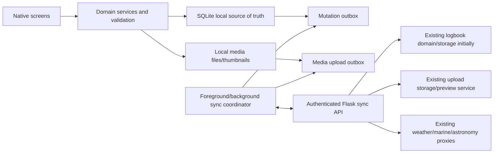

# Mobile Architecture Recommendation

## Executive Recommendation

Build the mobile client with **React Native + Expo + TypeScript**, using Expo development builds rather than relying on Expo Go for production capability testing. Use a local SQLite database, a durable mutation/media outbox, native filesystem storage, foreground GPS/camera capture, and opportunistic background synchronization. Retain Flask as the backend, but extend it with authentication, schema versioning, revisions, and mobile-safe synchronization endpoints before release.

This is a native mobile client, not a wrapper around `index.html`. The existing web application should remain operational during migration.

## Decision Drivers

- The current domain and UI logic are JavaScript, reducing language/context switching for a small team.
- Camera, GPS, media library, filesystem, secure credentials, SQLite, notifications, and deferred background work are first-class requirements.
- Remote fishing areas make local-first structured storage and failure-proof drafts mandatory.
- The present Flask whole-document PUT cannot safely synchronize multiple offline replicas.
- Most existing HTML/CSS cannot be reused meaningfully; business rules and test fixtures can.
- One shared iOS/Android codebase materially lowers maintenance burden.

## Option Evaluation

| Option | Advantages | Disadvantages | Fit |
|---|---|---|---|
| React Native without a framework | Native UI, JavaScript/TypeScript, broad ecosystem, direct control of native projects. | More manual native configuration, dependency integration, build tooling, permissions, and upgrade work. | Good technically, but unnecessary maintenance for this team/profile. |
| React Native with Expo | Same language family as current code; production-grade React Native framework; file-based routing; integrated camera, location, SQLite, filesystem, secure storage, background tasks, updates/build tooling; native modules remain possible through development builds/config plugins. | Requires a new app codebase; background execution still obeys OS limits; some advanced modules require development builds/native configuration; Expo SDK upgrades must be managed. | **Best overall fit.** |
| Flutter | Strong rendering consistency, native compilation, good performance, rich package ecosystem. | Introduces Dart and an entirely separate UI/business-logic ecosystem; little direct leverage from existing JavaScript; smaller team must maintain Flutter plus Python/JS web. | Strong greenfield option, weaker migration fit. |
| Native Swift + Kotlin | Maximum platform integration, best control over background location/camera/platform conventions. | Two applications, duplicated domain/sync work, largest staffing and maintenance burden, slowest parity for a small team. | Appropriate only if deep platform-specific tracking becomes the dominant product. |
| Progressive Web App | Highest reuse potential for HTML/CSS/JS; one deployment; installable and capable of offline caches/IndexedDB/background APIs where supported. | Device/background behavior varies by browser/OS; app-store/native polish is weaker; camera/GPS/file lifecycle and long-running/background tracking are less predictable; current app has no service worker, IndexedDB model, or conflict-aware sync, so “reuse” is smaller than it appears. | Useful as an interim responsive web client, not the recommended first-class field app. |

Current React Native documentation recommends using a framework and identifies Expo as a production-grade React Native framework. Expo’s current SDK provides persistent SQLite, camera/video capture, location polling/subscriptions, background location, and deferrable background tasks. Background tasks are scheduled by the operating system and may run late or not at all until battery/network conditions permit, so they cannot be the primary durability mechanism.

Official references:

- [React Native: Get Started](https://reactnative.dev/docs/environment-setup)
- [Expo SQLite](https://docs.expo.dev/versions/latest/sdk/sqlite/)
- [Expo Camera](https://docs.expo.dev/versions/latest/sdk/camera/)
- [Expo Location](https://docs.expo.dev/versions/latest/sdk/location/)
- [Expo Background Task](https://docs.expo.dev/versions/latest/sdk/background-task/)
- [Flutter for React Native developers](https://docs.flutter.dev/get-started/flutter-for/react-native-devs)
- [MDN Progressive Web Apps](https://developer.mozilla.org/en-US/docs/Web/Progressive_web_apps)

## Recommended Client Stack

| Concern | Recommendation |
|---|---|
| Language | TypeScript with strict mode. |
| App framework | Expo/React Native with development builds and config plugins. |
| Navigation | Expo Router or equivalent typed native stack/tab navigation with entity deep links. |
| Local database | Expo SQLite in WAL mode, explicit migrations, foreign keys, and transaction boundaries. |
| Small secrets | SecureStore for access/refresh credentials and server enrollment tokens; never store full logbook in key-value secure storage. |
| Media | App filesystem for originals/pending files; local thumbnail generation; database rows track lifecycle/checksum. |
| Camera/library | Expo Camera and Image Picker/Media Library as appropriate. |
| GPS | Expo Location foreground fixes at capture; background location only for an explicit future trip-tracking feature. |
| Connectivity | Network state as a hint only; attempt/retry requests because “online” does not guarantee server reachability. |
| Background work | BackgroundTask for opportunistic sync; foreground/app-resume sync is authoritative. |
| Server state | A small sync/domain layer rather than mirroring the entire server JSON into UI state. |
| Testing | Unit tests for domain/migrations; repository tests for SQLite; contract tests against Flask; device E2E on physical iOS/Android. |

## Target Architecture

## Client Data Boundaries

SQLite is the mobile source of truth. Screens read local tables/queries only. Network responses are committed to SQLite before the UI treats them as durable. Every local write and its outbox entry occur in one transaction.

Recommended local groups:

- Domain entities: trips, setup lines, catches, lost fish, people, locations, launches, lures, flashers, rods, reels, combos, line history, settings, option lists.
- Enrichment snapshots: trip weather, catch weather, marine, astronomy.
- Media: local URI, remote identity, category, metadata, checksum, upload state, attachment relationship.
- Sync metadata: entity revision, dirty state, deleted tombstone, device mutation ID, last sync/error.

Do not store one giant JSON blob as the primary mobile database. It makes partial queries, migrations, media state, referential integrity, conflict handling, and incremental sync unnecessarily fragile. Preserve the existing JSON shape at import/export and legacy API boundaries.

## Backend Compatibility and Required Evolution

### Can remain substantially unchanged

- Flask/Python hosting model.
- Weather archive/forecast, marine, and astronomy proxy helpers, after authentication/rate limiting.
- Upload category storage, metadata sidecars, Pillow previews, and media delivery paths.
- Existing normalization rules as migration inputs.
- JSON export and host/NAS backup scripts.
- Existing web routes and web client during coexistence.

### Must be extended before mobile launch

- Authentication/enrollment suitable for a private self-hosted server and mobile device.
- TLS deployment guidance; never send credentials or private GPS over plain remote HTTP.
- A schema version and recursive validation.
- Server revisions/ETags and atomic writes.
- Incremental pull and idempotent push semantics, preferably entity-level.
- Tombstones for deletions and referential validation on the server.
- Media upload idempotency/checksums, size limits, and safe retry behavior.
- A sync cursor or change log so mobile does not download the full media/logbook history after every edit.

### Transitional compatibility path

The current `GET /api/logbook` can bootstrap a first device and serve read-only compatibility. The current whole-document `PUT` should not be used for routine offline synchronization. If an entity sync API cannot be built immediately, add a temporary revisioned compare-and-swap document endpoint and restrict the beta to one editing device; this is a bridge, not the production design.

## Authentication Recommendation

For a private self-hosted app, support device enrollment through a short-lived code or QR displayed by the trusted web server. Exchange it over HTTPS for revocable access/refresh credentials stored in SecureStore. Provide device listing/revocation in the web settings. Do not embed a shared static API key in the application binary.

## Background Work Requirements

- Save locally synchronously before any network operation.
- Sync immediately while foregrounded when the server is reachable.
- Retry when the app resumes and after a manual “Sync now.”
- Use OS background tasks only to improve eventual delivery.
- Show pending/failed item counts and last successful sync.
- Do not promise exact background timing. Expo documents that iOS/Android schedule deferred work according to system, battery, network, and user behavior; user termination can stop tasks until restart.

Background GPS is not required for launch. Foreground current-location capture is enough for catch coordinates and carries far less battery/privacy/store-review risk.

## PWA Role in the Strategy

The existing responsive web app may continue as the desktop/admin surface and emergency fallback. A PWA enhancement could improve home-screen installation and cached shell behavior, but it would still need a real local database and synchronization model. It should not delay the native field app or be described as equivalent to robust native offline capture.

## Architecture Decision Record

**Decision:** Expo React Native with SQLite local-first architecture and an evolved Flask sync API.

**Rejected as primary:** direct web wrapper/PWA because first-class offline media/GPS/background reliability is the core requirement; Flutter because it adds a new language without a compensating domain advantage; dual native because staffing and parity costs are excessive; bare React Native because Expo removes material tooling/native-integration burden while preserving an escape hatch.

**Revisit triggers:** sustained need for high-frequency sonar/Bluetooth integrations, always-on navigation, platform-specific camera/computer-vision pipelines, or OS features unsupported by Expo modules/config plugins. Those can first be addressed with custom native modules inside Expo development builds before considering two independent native apps.
